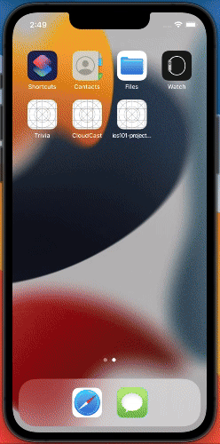

# Project 5 - Tumblr Photo Feed

Submitted by: **Andry Rakotonjanabelo**

**Tumblr Photo Feed** is an app that displays photo posts from a Tumblr blog using the Tumblr API. Users can view photo summaries and images in a scrollable table view. The app also supports refreshing the feed and alternating between two different blogs.

Time spent: **6** hours spent in total

## Required Features

The following **required** functionality is completed:

- [x] App has a configured table view and table view cell
- [x] App populates the table view with data fetched from an API

## Optional Features

The following **optional** features are implemented:

- [x] App fetches posts from a different Tumblr blog
- [x] App has a refresh control to update the table view

## Additional Features

The following **additional** features are implemented:

- [x] Alternates between two different Tumblr blogs with each refresh
- [x] Prints debug statements to help trace data flow and cell rendering
- [x] Dynamic row heights to support varying image sizes and summary lengths

## Video Walkthrough

Add your walkthrough link here once it's ready:

## Notes

Some challenges I encountered:
- Correctly configuring the `PostCell` and linking outlets in the storyboard (initially had a typo with `summaryLalbe`)
- Debugging layout issues when labels and images were bunched up
- Implementing the refresh control with state toggling between blog sources

## License

Copyright 2025 Andry Rakotonjanabelo

    Licensed under the Apache License, Version 2.0 (the "License");
    you may not use this file except in compliance with the License.
    You may obtain a copy of the License at

        http://www.apache.org/licenses/LICENSE-2.0

    Unless required by applicable law or agreed to in writing, software
    distributed under the License is distributed on an "AS IS" BASIS,
    WITHOUT WARRANTIES OR CONDITIONS OF ANY KIND, either express or implied.
    See the License for the specific language governing permissions and
    limitations under the License.
